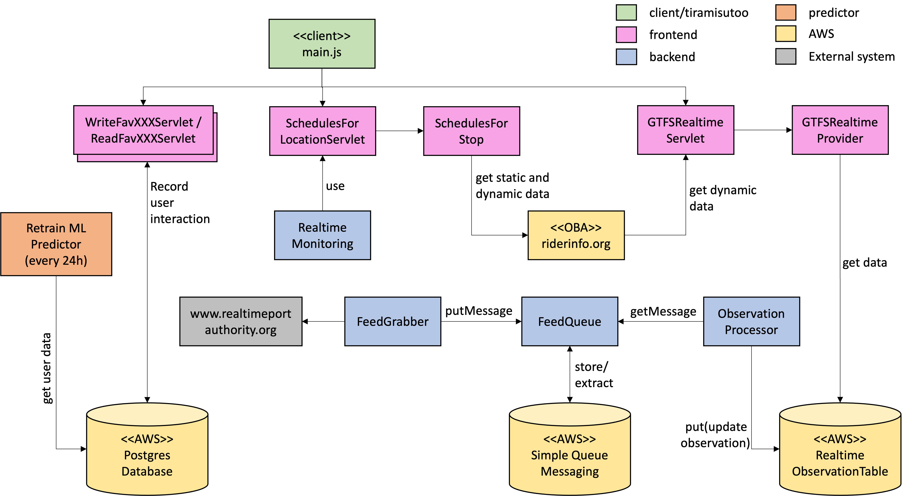
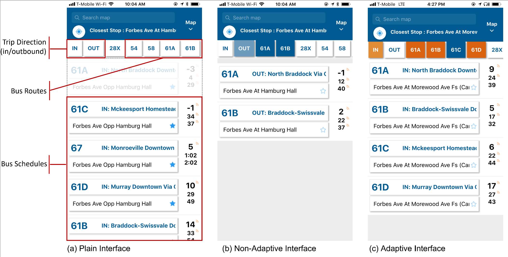

# Tiramisu3-PR
This is the Public Release version of Tiramisu3, an adaptive mobile transit app that shows real-time bus arrival information developed and deployed by Carnegie Mellon University. It adapts the information display by predicting and filtering for the bus routes users are most likely interested in using time of day and location. Tiramisu3 fed transit information from two main agencies: Port Authority of Allegheny County (PAAC) in Pittsburgh, Pennsylvania; and MTA in New York City. Core funding for this work and the bulk of the associated research was through the [Rehabilitation Engineering Research Center on Accessible Public Transportation (RERC-APT)](http://rercapt.org/). Additional information about the research can be found at the [Transportation, Bots, & Disability Lab](https://tbd.ri.cmu.edu/).


# Overall Architecture:

Tiramisu3 is designed as a layered architecture as follows: a mobile-based layer that supports both Android and iOS devices; a Java frontend that processes all the requests from the client layer and backend running processes, and communicates with the lower layers; a backend layer that handles a set of information extraction and monitoring processors that are triggered periodically; a Python prediction layer that is in charge of executing a machine learning algorithm to predict user's bus route filters; and an infrastructure layer backed on Amazon Web Services (AWS).

<p align="center">
       
</p>

**Note:** take into account that the picture above does not depict all the modules and components of the Tiramisu3's architecture, it is only a simplified version that is good enough to understand the flow of information through the system.


# Subsystems

In the following, a brief description of each subsystem is provided.

## Mobile App (Client)
*[Directory: client/tiramisutoo/]*

Having in mind the non-functional multi-platform requirement, Tiramisu3's client layer was developed using Ionic framework. [Ionic](https://ionicframework.com/) is a framework that allows for building cross-platform apps using the same codebase.

Tiramisu3's user interface is adaptive (see picture below). When users download Tiramisu3 app for the very first time, the will see a screen as the one on the left where all the bus routes (including both inbound and outbound directions) for the current location are shown. Users have to scroll down to see all the results (e.g., the location shown in this figure has 14 bus schedule rows for 8 routes). Users can manually select filters for in/outbound direction and preferred bus routes, as shown on the screen at the center of the picture. For instance, in the depicted picture, the user has selected filters for bus routes 61A and 61B with outbound direction (blue boxes) -- at this point there is no adaptation yet. In the right screen, there is an example of an adaptive interface that has prioritized the results. The top section of the results window contains the most frequently routes the user takes given the current context (time and location) filtered by either inbound or outbound direction, i.e., bus routes 61A, 61B, and 61D. Filter buttons are colored differently. Orange shows the actions taken by the app, the predicted filters. Blue shows filters selected by the user.


<p align="center">
       
</p>


## Frontend

### WriteFavXXXServlet and ReadFavXXXServlet
*[Directory: frontend/tiramisu/src/main/java]*

These two types of servlets write and read data to and from the Postgres database, where all user's interaction is logged to (e.g., navigation, button and filter selection, component's change of focus, etc.) For instance, WriteFavRouteServlet and ReadFavRouteServlet, write and read information (respectively) related to user's favorite bus routes according to the context (time, day of the week, and location). This information is used as well by the prediction layer, as explained later.

### SchedulesForLocationServlet
*[Directory: frontend/tiramisu/src/main/java]*

This servlet processes requests from the client by using user's current location (latitude and longitude coordinates) to search for bus schedules for a specific bus stop. To this purpose, the servlet queries [OneBusAway](https://onebusaway.org/) (OBA for short), an open source platform for real-time transit info. The OBA bundle needs to be deployed in a web server, so it can listen to requests from SchedulesForLocationServlet. For illustration purposes, OBA was running on a AWS instance under the riderinfo.org domain.

### GTFSRealtimeServlet and GTFSRealtimeProvider
*[Directory: frontend/tiramisu/src/main/java]* \
*[Directory: frontend/tiramisu/src/main/java/realtime]*

These two components process requests from the client to get real-time information from RealtimeObservationsTable (as explained below). More specifically, GTFSRealtimeServlet gets information about vehicle (bus) positions and trip updates. The prefix GTFS stands for General Transit Feed Specification, a standard format for public transportation schedules and associated geographic information (see details of the [GTFS specification](https://developers.google.com/transit/gtfs)).


## Backend
This layer defines 5 automatic processes (schedule them by setting up a cron job):

### FeedGrabber
*[Directory: backend/gtfs-realtime-processor/src/main/java/cmu/edu/gtfs_realtime_processor/avl]*

This process feeds real-time transit information from both PortaAuthority (PAAC) and New York City (MTA) agencies. More specifically, it fetches information about routes (vehicle positions and predicted arrival times) and trip updates. The information that is fed from the agencies uses the GTFS format, so the FeedGrabber first parses GTFS updates into messages in json format. Then, the messages are pushed onto a FeedQueue object that is backed by AWS SimpleQueueMessaging. After that, messages are readily available by any other consumer (like ObservationProcessor).

### ObservationProcessor
*[Directory: backend/gtfs-realtime-processor/src/main/java/cmu/edu/gtfs_realtime_processor/avl]*

This processor continually checks the contents of the FeedQueue. If there are new messages in the queue (indicating that the FeedGrabber posted updates of the real-time transit information), then the processor dequeues the messages, parses them, and them inserts them into the RealtimeObservationsTable to make them available to the GTFSRealtimeProvider. The RealtimeObservationsTable is a table that is stored on a (AWS) Dynamo database, however, you can use any other NoSQL database service.

### RealTimeMonitoring
*[Directory: backend/gtfs-realtime-processor/src/main/java/cmu/edu/gtfs_realtime_processor/avl]*

This processor runs every 24 hours and its purpose is to assure that the real-time system is working properly. To this end, the processor requests the bus schedules for a bunch of predefined locations (latitude, longitude pairs) through the SchedulesForLocationServlet. The result of each request is a list of vehicle location objects, where each object contains both static and real-time information of the bus. If objects do not contain real-time information (i.e., the attribute "predicted" of the object is "false") then the processor emails a notification to the primary contact email that you set up.


### DynamoCleaner
*[Directory: backend/gtfs-realtime-processor/src/main/java/cmu/edu/gtfs_realtime_processor/avl]*

This processors removes completely the temporary data on RealtimeObservationsTable. Additionally, it purges all the messages from the feed queues. This processor has to be used when the GTFS information is updated (see Guides below) and therefore a fresh start is needed.

### AlarmProcessor
*[Directory: backend/alarm-processor/src/main/java/cmu/edu/alarm_processor/]*

The AlarmProcessor pushes notifications to users' devices (either iOS or Android) regarding next bus arrivals filtered by stop. The notifications may contain information about the route name, the trip headsign, and the stop name. Information about alarms is extracted by the processor from table user_data.alarms.


## Filter Predictor
*[Directory: predictor/route_predict/]*

Tiramisu3 uses a Machine Learning algorithm (Random Forest) to automatically filter out information on arriving transit vehicles based on information about the user's current context. Random Forest model uses a simple but powerful supervised ML method that combines many weak learners (decision trees) into strong learners improving prediction accuracy. If available, the Random Forest model employs the user's previous behavior to predict route filters. Otherwise, it makes filter predictions based on traffic behaviors observed in a group of similar users.

The filter predictor component defines a 30-tree-estimator classifier per user which trains on user logs, where selection/deselection of route filters are used as a means to label correct/incorrect adaptations. That is, every time the user selects/deselects a route filter (labels), the system logs the time, date, day of the week, location, and any selected inbound/outbound bus filter (features). Then, the system uses these features and labels to train the ML model so it could predict which routes and direction the user would select.

When users select additional filters, then the system captures this as new training data (and the model is retrained every 24 hours). When users deselect predicted filters, then this considered as a mislabeling error. At least 80 samples (filter selections) are needed in order for the Random Forest algorithm to make a route prediction for a specific user.


# Guides

This section provides a set of handful guides to set up and maintain Tiramisu3.
## Development Setup

### Client

1. Clone the code from Github
1. npm i ionic-run-external-address (inside the repo)
1. Follow the instructions found [here](https://ionicframework.com/docs/installation/cli/). Ignore the steps for creating a new project.
1. Go into the client/tiramisutoo directory and run `npm install` to get the required packages.
1. Try running `ionic build` in the master branch.
1. If you want to test using `ionic serve` (recommended for early testing), then you need to setup a proxy as described [here](http://blog.ionic.io/handling-cors-issues-in-ionic/). The key part is under the "Setting up the proxy urls" section.
1. You can follow the steps on (or directly execute) the [setup.sh](client/tiramisutoo/setup.sh) script:
  * Installing packages for 'typescript':
    * `npm install`
    * `npm install @ionic/app-scripts@latest --save-dev`
  * Installing package keyboard:
    * `npm install --save @ionic-native/keyboard@4.12.0`
    * `npm audit fix --force`
  * Check this command works:
    * `ionic serve`
  * Install resources for android:
    * `ionic cordova resources android`
  * Install resources for ios:
    * `ionic cordova resources ios`
  * Install additional plugins:
    * `npm i cordova-sqlite-storage@latest`
    * `npm i cordova-android-support-gradle-release@latest`
    * `ionic cordova plugin add cordova-sqlite-storage@latest`
    * `ionic cordova plugin add cordova-android-support-gradle-release`
    * `cordova plugin add cordova-plugin-whitelist`
  * Add android platform:
    * `ionic cordova platform add android`
  * Add ios platform:
    * `ionic cordova platform add ios`
  * Prepare android platform:
    * `ionic cordova prepare android`
  * Prepare ios platform:
    * `ionic cordova prepare ios`
  * Copy google-services.json to the right location:
    * `cp google-services.json platforms/android/app/`
    * `cordova plugin add cordova-support-google-services --save`
    * `sed -i '' 's/target=\"google-services/target=\"app\/google-services/g' config.xml`
  * Modify min sdk version to 19:
    * `sed -i '' 's/cdvMinSdkVersion=.*/cdvMinSdkVersion=19/g' platforms/android/gradle.properties`
  * Build android platform:
    * `ionic cordova build android`
  * Build ios platform:
    * `ionic cordova build ios`
  * Run the app in android platform:
    * `ionic cordova run android -l`
  * Run the app in ios platform:
    * `ionic cordova run ios -l`


### Server

**Install Tomcat**

1. Install Tomcat 8 on your machine (if you are on Mac use [homebrew](http://brew.sh/index.html))
2. Copy/paste the `setenv.sh` file from the `tiramisu/frontend` directory in the master branch to your `<TOMCAT_HOME>/bin` directory

**Run Tiramisu**

1. Build the tiramisu war file by going into the `frontend/tiramisu` directory in the master branch and running
    `mvn package`
1. Move the war file generated in the target folder to the webapps folder in the Tomcat installation
1. Set the OBA_URL and OBA_API_KEY according to the path to OBA
1. Start (or restart) the server


## Admin Reference

### Update GTFS

Do this periodically (a week ahead before the current GTFS feed expires):
1. Download and unzip the most recent GTFS updates for [MTA](http://web.mta.info/developers/developer-data-terms.html#data) and [PAAC](https://www.portauthority.org/business-center/developer-resources/)
1. Generate realtime processor jars: `mvn package backend/gtfs-realtime-processor`
1. Generate the combined MTA GTFS (merge the GTFS for the 6 different bureaus into one consistent GTFS -- Bronx, Brooklin, Manhattan, Queens, Staten Island, and Bus Company):
`java -Xmx10G -cp gtfs-realtime-processor-0.0.1-SNAPSHOT.jar gtfs.CombineGTFS -i <GTFS_MTA_PATH>/downloaded_mta_gtfs/ -o <GTFS_MTA_PATH>/combined_mta_gtfs/`
1. Create data transit bundle OBA:
`java -Xmx6G -jar onebusaway-transit-data-federation-builder-1.1.14-withAllDependencies.jar -P tripEntriesFactory.throwExceptionOnInvalidStopToShapeMappingException=false bundle.xml combined_agencies_data_bundle/ > bundle.log`
1. Check bundle.log for errors (you may have to change the lat/lon of some stops (likely stop id 501665) in the combined MTA GTFS from one bureau to another, look for errors (keywords: error, problem, potential) in stop/shape mapping)
1. Create the bundle/OBA war: `jar -cvf ../wars/oba.war *`
1. Create AWS Elastic Beanstalk package: `zip ../app/app_<version>.zip -r * .[^.]* -x .DS_Store`
1. Upload `app_<version>.zip` (OBA bundle) to AWS Elastic Beanstalk
1. Upload GTFS to S3: create a new folder in S3 where the name is a range of dates, then upload all the GTFS files
1. On the correct day (possibly through scheduling):
  1. Deploy EB package: on Elastic Beanstalk, tiramisu (top level menu), Application Versions
  1. Test the app
  1. Restart realtime processes (FeedGrabber(s), ObservationProcessor)
  1. Check if DynamodbCleaner is running, and restart if not
  1. Purge realtime queues in AWS (SQS)
  1. Check if FeedGrabber and ObservationProcessor are running


### Deploying to elasticbeanstalk

1. First must setup the eb cli locally ([See here](http://docs.aws.amazon.com/elasticbeanstalk/latest/dg/eb-cli3-configuration.html))
1. Create and upload a new package (the zip file on step 8 in Section **Update GTFS**)
1. Follow instructions from AWS EB deployment [here](http://docs.aws.amazon.com/elasticbeanstalk/latest/dg/eb3-deploy.html)
1. Execute this command:

```
eb deploy <environment_name> --version <package_name>
```

### Admin Commands

All these commands need to be run in the correct directory with appropriate files/folders as input. Additionally these commands should each be run in their own linux screen session.

#### Running realtime processes
    java -Xmx6G -cp target/gtfs-realtime-processor-0.0.1-SNAPSHOT.jar cmu.edu.gtfs_realtime_processor.avl.ObservationProcessor
    java -cp target/gtfs-realtime-processor-0.0.1-SNAPSHOT.jar cmu.edu.gtfs_realtime_processor.avl.FeedGrabberPAAC
    java -Xmx4G -cp target/gtfs-realtime-processor-0.0.1-SNAPSHOT.jar cmu.edu.gtfs_realtime_processor.avl.FeedGrabberMTA
    java -cp target/gtfs-realtime-processor-0.0.1-SNAPSHOT.jar cmu.edu.gtfs_realtime_processor.avl.DynamoCleaner
    java -cp target/gtfs-realtime-processor-0.0.1-SNAPSHOT.jar cmu.edu.gtfs_realtime_processor.avl.RealTimeMonitoring

#### Running alarm processor
    java -cp target/alarm-processor-0.0.1-SNAPSHOT.jar cmu.edu.alarm_processor.AlarmProcessor


# Troubleshooting

This section provides helpful hints on how to solve the most common error you may find when either building the client layer or when generating the OBA bundle.

## Client

1. Error: Cannot find module 'typescript'. \
Solution:
  * `npm install`
  * `npm install @ionic/app-scripts@latest --save-dev`
  * `npm audit fix --force`

1. Error: Property 'disableScroll'/'close' does not exist on type 'Keyboard'. \
Solution:
  * `npm install --save @ionic-native/keyboard@4.12.0`

1. Error: Source path does not exist: resources/ios/icon/icon-1024.png\
	Solution:
	- `ionic cordova platform add ios`
	- `ionic cordova resources android`
	- `ionic cordova resources ios`

1. Error: Manifest merger failed : uses-sdk:minSdkVersion 16 cannot be smaller than version 19 declared in library [:CordovaLib] .../client/tiramisutoo/platforms/android/CordovaLib/build/intermediates/library_manifest/debug/AndroidManifest.xml as the library might be using APIs not available in 16. Suggestion: use a compatible library with a minSdk of at most 16\
	Solution:
	- modified cdvMinSdkVersion=19 in gradle.properties
	- commented out <uses-sdk android:minSdkVersion="16" android:targetSdkVersion="28" />

1. Error: Failed to install 'XXXXXX': CordovaError: Using "requireCordovaModule" to load non-cordova module "q" is not supported.\
Solution:
  * Remove ios platform: `ionic cordova platform rm ios`
  * Remove android platform: `ionic cordova platform rm android`
  * Remove XXX plugin: `ionic cordova plugin rm XXX`
  * Install latest XXX npm package: `npm i XXXX@latest`
  * Install XXX plugin: `ionic cordova plugin add XXX`
  * Add ios platform: `ionic cordova platform add ios`
  * Add android platform: `ionic cordova platform add android`

1. Error: File google-services.json is missing\
Solution:
  * Copy `google-services.json` from current directory to `platforms/android/app` directory
  * Install plugin: `cordova plugin add cordova-support-google-services --save`
  * Modify config.xml:
  ```
  <platform name="android"> ...
      <resource-file src="google-services.json" target="app/google-services.json" />
   ... </platform>
   ```

1. Error: Manifest merger failed : uses-sdk:minSdkVersion 16 cannot be smaller than version 19 declared in...\
Solution:
  * Modify `cdvMinSdkVersion=19` in `platforms/android/gradle.properties`


## OBA bundle generation

1. Error: [IndividualCsvEntityReader.java:110] : expected and actual number of csv fields differ: type=org.onebusaway.gtfs.model.Stop line # 15395 expected=5 actual=4\
Solution:
	* this error usually occurs on stops.txt in PAAC and Manhattan
	* run check_missing_lat_long from python code, and also do the following:
	* look for line in combined.../stops.txt
	* copy/paste street name and search for it (e.g., grep -iR "text_to_search" *)
	* modify the file and re-run the script

1. Error: WARNING: An illegal reflective access operation has occurred
	.... java.lang.IllegalStateException: error invoking refresh method=public void org.onebusaway.transit_data_federation.impl.ExtendedCalendarServiceImpl.\
  Solution:
	* Use Java 1.8. Higher versions may throw errors

1. Error: java.lang.IllegalStateException: expected just one assignment at this point\
  Solution:
	* use OBA version 1.1.14 instead of OBA version 2.0.0 or higher

1. Error: error building transit data bundle java.lang.NullPointerException at org.onebusaway.transit_data_federation.bundle.tasks.transit_graph.StopEntriesFactory.processStops(StopEntriesFactory.java:79)
	at org.onebusaway.transit_data_federation.bundle.tasks.transit_graph.TransitGraphTask.run(TransitGraphTask.java:100)
	at sun.reflect.NativeMethodAccessorImpl.invoke0(Native Method)
	at sun.reflect.NativeMethodAccessorImpl.invoke(NativeMethodAccessorImpl.java:62)
	at sun.reflect.DelegatingMethodAccessorImpl.invoke(DelegatingMethodAccessorImpl.java:43)
	at java.lang.reflect.Method.invoke(Method.java:498)
	at org.springframework.aop.support.AopUtils.invokeJoinpointUsingReflection(AopUtils.java:309)
	at org.springframework.aop.framework.ReflectiveMethodInvocation.invokeJoinpoint(ReflectiveMethodInvocation.java:183)
	at org.springframework.aop.framework.ReflectiveMethodInvocation.proceed(ReflectiveMethodInvocation.java:150)
	at org.springframework.transaction.interceptor.TransactionInterceptor.invoke(TransactionInterceptor.java:110)
	at org.springframework.aop.framework.ReflectiveMethodInvocation.proceed(ReflectiveMethodInvocation.java:172)
	at org.springframework.aop.framework.JdkDynamicAopProxy.invoke(JdkDynamicAopProxy.java:202)
	... \
  Solution:
  - this error is mostly due to changes on the PAAC version (clever version). To fix it, replace agency_id "2" with "PAAC" in files agency.txt and routes.txt

1. Error: [DistanceAlongShapeLibrary.java:346] : expected just one assignment at this point, found 2; shapePoint=....,
possibleAssignments=
PointAndIndex(....
stopTime=StopTimeEntry(Stop(.....\
Solution:
  * this error is caused by stop_times that only have a single trip_id associated (instead of multiple). So, use tools.find_wrong_stop_times() to remove those stop_times.

1. Error: missing required field java.lang.IllegalStateException: error loading gtfs...
Caused by: org.onebusaway.csv_entities.exceptions.MissingRequiredFieldException: missing required field: stop_lon\
Solution:
  - Look for the line number in the error trace
  - open stop.txt files, look for the line number
  - check if lat and lon are correct.
  - rebuild

1. Error: Sometimes the Shape table (dynamo) does not contain the most recent shape information (you can check it by comparing shape_ids in the table with those in shapes.txt). \
  Solution:
  - run ShapeDataProcessor.java

1. Error: Problem (EB): Script timed out before returning headers: application.py\
  Solution:
  - Follow [this procedure](https://stackoverflow.com/questions/41812497/aws-elastic-beanstalk-script-timed-out-before-returning-headers-application-p)

1. Error: OSError: libnccl.so.2: cannot open shared object file: No such file or directory\
  Solution:
  - Follow [this procedure](https://discuss.mxnet.apache.org/t/oserror-libnccl-so-2-cannot-open-shared-object-file-no-such-file-or-directory/6966)


# Related Papers:
This a list of the most representative [published work](doc/papers.md) about the Tiramisu project.


```
@inproceedings{tiramisu:2020,
  title={A Long-Term Evaluation of Adaptive Interface Design for Mobile Transit Information},
  author={Romero, Oscar J and Haig, Alexander and Kirabo, Lynn and Yang, Qian and Zimmerman, John and Tomasic, Anthony and Steinfeld, Aaron},
  booktitle={22nd International Conference on Human-Computer Interaction with Mobile Devices and Services},
  pages={1--11},
  year={2020}
}

```

<!-- ```
@misc{tiramisu:2016,
  title={Tiramisu: Information from Live Data Streams},
  author={Tomasic, Anthony and Giampapa, Joseph and Gardiner, Steven and Deng, Sophia and Steinfeld, Aaron},
  journal={TSET UTC Final Project Report},
  year={2016}
}
``` -->
```
@article{traut2019identifying,
  title={Identifying commonly used and potentially unsafe transit transfers with crowdsourcing},
  author={Traut, Elizabeth J and Steinfeld, Aaron},
  journal={Transportation Research Part A: Policy and Practice},
  volume={122},
  pages={99--111},
  year={2019},
  publisher={Elsevier}
}
```

```
@article{steinfeld2019increasing,
  title={Increasing Access to Transit: Localized Mobile Information},
  author={Steinfeld, Aaron and Bloomfield, Leslie and Amick, Sarah and Huang, Yun and Odom, Will and Yang, Qian and Zimmerman, John},
  journal={Journal of Urban Technology},
  volume={26},
  number={3},
  pages={45--64},
  year={2019},
  publisher={Routledge}
}
```

```
@article{pi2018understanding,
  title={Understanding Human Perception of Bus Fullness: An Empirical Study of Crowdsourced Fullness Ratings and Automatic Passenger Count Data},
  author={Pi, Xidong and Qian, Zhen and Steinfeld, Aaron and Huang, Yun},
  journal={Transportation Research Record},
  volume={2672},
  number={8},
  pages={475--484},
  year={2018},
  publisher={SAGE Publications Sage CA: Los Angeles, CA}
}
```

```
@book{steinfeld2017accessible,
  title={Accessible Public Transportation: Designing Service for Riders with Disabilities},
  author={Steinfeld, Aaron and Maisel, Jordana L and Steinfeld, Edward},
  year={2017},
  publisher={Routledge}
}
```

```
@inproceedings{yang2016planning,
  title={Planning Adaptive Mobile Experiences When Wireframing},
  author={Yang, Qian and Zimmerman, John and Steinfeld, Aaron and Tomasic, Anthony},
  booktitle={Proceedings of the 2016 ACM Conference on Designing Interactive Systems},
  pages={565--576},
  year={2016},
  organization={ACM}
}
```

```
@inproceedings{huang2016combining,
  title={Combining contribution interactions to increase coverage in mobile participatory sensing systems},
  author={Huang, Yun and Zimmerman, John and Tomasic, Anthony and Steinfeld, Aaron},
  booktitle={Proceedings of the 18th International Conference on Human-Computer Interaction with Mobile Devices and Services},
  pages={365--376},
  year={2016},
  organization={ACM}
}
```

```
@techreport{tomasic2015performance,
  title={The performance of a crowdsourced transportation information system},
  author={Tomasic, Anthony and Zimmerman, John and Garrod, Charles and Huang, Yun and Nip, Terence and Steinfeld, Aaron},
  year={2015}
}
```

```
@inproceedings{tiramisu:2014,
  title = {Motivating Contribution in a Participatory Sensing System via Quid-pro-Quo},
  author = {Tomasic, Anthony and Zimmerman, John and Steinfeld, Aaron and Huang, Yun},  
  year = {2014},
  booktitle = {Proceedings of the 17th ACM Conference on Computer Supported Cooperative Work & Social Computing},
  pages = {979–988},
  numpages = {10}
}
```

```
@article{steinfeld2013co,
  title={Co-producing value through public transit information services},
  author={Steinfeld, Aaron and Rao, Shree Lakshmi and Tran, Allison and Zimmerman, John and Tomasic, Anthony},
  journal={Advances in the Human Side of Service Engineering},
  pages={231--40},
  year={2013},
  publisher={CRC Press Boca Raton}
}
```

```
@inproceedings{huang2013energy,
  title={Energy efficient and accuracy aware (E2A2) location services via crowdsourcing},
  author={Huang, Yun and Tomasic, Anthony and An, Yufei and Garrod, Charles and Steinfeld, Aaron},
  booktitle={Wireless and Mobile Computing, Networking and Communications (WiMob), 2013 IEEE 9th International Conference on},
  pages={436--443},
  year={2013},
  organization={IEEE}
}
```

```
@inproceedings{tiramisu:2011,
  title={Field trial of Tiramisu: crowd-sourcing bus arrival times to spur co-design},
  author={Zimmerman, John and Tomasic, Anthony and Garrod, Charles and Yoo, Daisy and Hiruncharoenvate, Chaya and Aziz, Rafae and Thiruvengadam, Nikhil Ravi and Huang, Yun and Steinfeld, Aaron},
  booktitle={Proceedings of the SIGCHI Conference on Human Factors in Computing Systems},
  pages={1677--1686},
  year={2011},
  organization={ACM}
}
```

```
@article{steinfeld2011mobile,
  title={Mobile transit information from universal design and crowdsourcing},
  author={Steinfeld, Aaron and Zimmerman, John and Tomasic, Anthony and Yoo, Daisy and Aziz, Rafae Dar},
  journal={Transportation Research Record},
  volume={2217},
  number={1},
  pages={95--102},
  year={2011},
  publisher={SAGE Publications Sage CA: Los Angeles, CA}
}
```

```
@inproceedings{yoo2010understanding,
  title={Understanding the space for co-design in riders' interactions with a transit service},
  author={Yoo, Daisy and Zimmerman, John and Steinfeld, Aaron and Tomasic, Anthony},
  booktitle={Proceedings of the SIGCHI Conference on Human Factors in Computing Systems},
  pages={1797--1806},
  year={2010},
  organization={ACM}
}
```

```
@article{steinfeld2010value,
  title={The value and acceptance of citizen science to promote transit accessibility},
  author={Steinfeld, Aaron and Dar Aziz, Rafae and Von Dehsen, Lauren and Park, Sun Young and Maisel, Jordana L and Steinfeld, Edward},
  journal={Technology and Disability},
  volume={22},
  number={1},
  pages={73--81},
  year={2010},
  publisher={IOS Press}
}
```


# Related Links

* [OneBusAway](https://onebusaway.org/)
* [GTFS Specification](https://developers.google.com/transit/gtfs)
* [Ionic Turorial](https://ionicpro.wistia.com/medias/tlntguizp1)
* [Installing Ionic](https://ionicframework.com/docs/installation/cli)
* [Setting up npm](https://www.npmjs.com/get-npm)

# Acknowledgements

Tiramisu has been supported by the National Institute on Disability, Independent Living, and Rehabilitation Research (NIDILRR grant number 90REGE0007). NIDILRR is a Center within the Administration for Community Living (ACL), Department of Health and Human Services (HHS). It was previously funded by NIDILRR (grant number 90RE5011-01-00) and the National Institute on Disability and Rehabilitation Research (grant numbers H133E080019 and H133E130004) within the Department of Education. No endorsement should be assumed by NIDILRR or the United States Government for the content contained on this website.

Additional support provided by Traffic21 at Carnegie Mellon University, NIDILRR SBIR (90BI0018), and the US DOT through the FTA/RITA SBIR (12.1-FT1-010), and the Technologies for Safe and Efficient Transportation University Transportation Center (DTRT12-G-UTC11).

We would like to thank everyone who has worked on Tiramisu over the years (a full list is being compiled). We also thank the Port Authority of Allegheny County for their incredibly valuable insights and assistance throughout the project.
